# 🗞️ Daily News App: 

Welcome to the **Daily News App**, in Kotlin Multiplatform (KMP) application.

### 🌟 Key Highlights & Technologies

- **🚀 Kotlin Multiplatform**: Single codebase for **Android**, **iOS**, and **Web**, maximizing code reuse and consistency.
- **🏗️ Clean Architecture & MVI**: Robust, scalable, and testable codebase using the Model-View-Intent pattern.
- **🔔 Firebase Cloud Messaging (FCM)**: Real-time push notifications to keep users engaged with breaking news.
- **📦 Room Database**: Advanced local persistence for a first-class **Offline-First** experience.
- **🌐 Ktor Networking**: High-performance multiplatform HTTP client for seamless API integration.
- **💉 Koin DI**: Lightweight and powerful dependency injection shared across all platforms.
- **🗺️ Interactive KMPMaps**: Native Google Maps integration for exploring news geographically.
- **📸 Peekaboo & Moko-Permissions**: Modern camera/gallery integration with secure permission handling.
- **🧪 Mokkery Testing**: Type-safe, compiler-plugin based mocking for reliable multiplatform unit tests.

---

## 📱 App Highlights & Feature Showcase

---

### 🚀 1. Splash & Startup
---
| Light Theme | Dark Theme |
| :---: | :---: |
| 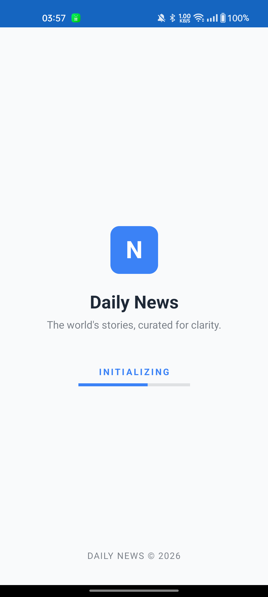 | 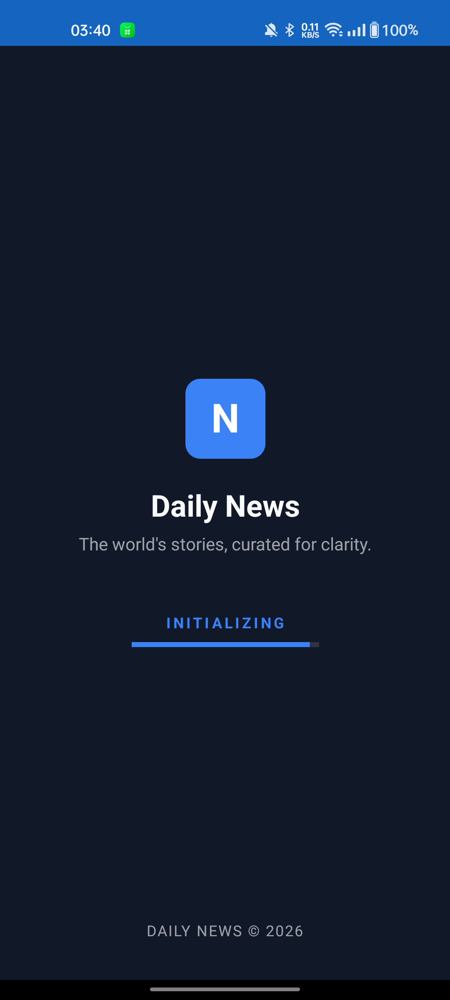 |

*   **Auto-Login**: Skips the login screen and takes you directly to the dashboard if you have logged in before.
.

### 🔐 2. Authentication - Login
---
| Light Theme | Dark Theme |
| :---: | :---: |
| 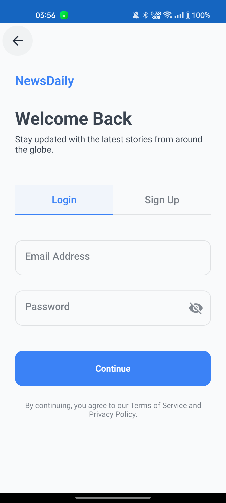 | 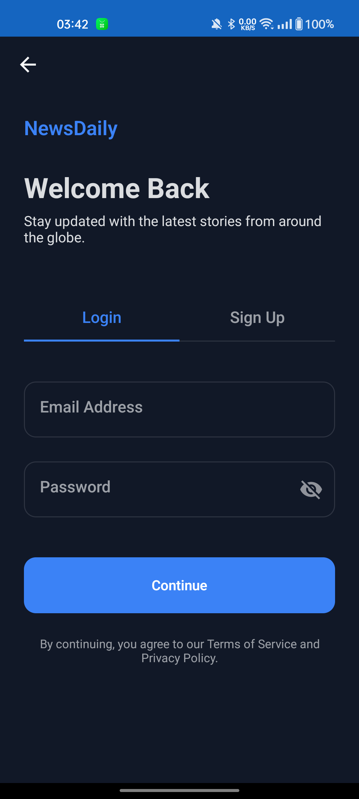 |

*   **Login**: Enter your username and password.
*   **Hide/Show Password**: You can choose to show or hide your password while typing for better security.


### 📝 3. Authentication - Signup
---
| Light Theme | Dark Theme |
| :---: | :---: |
| 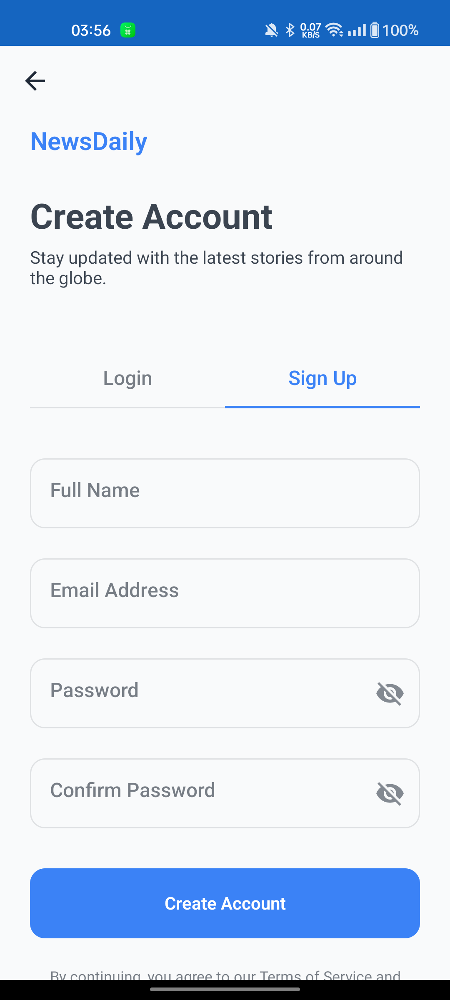 | 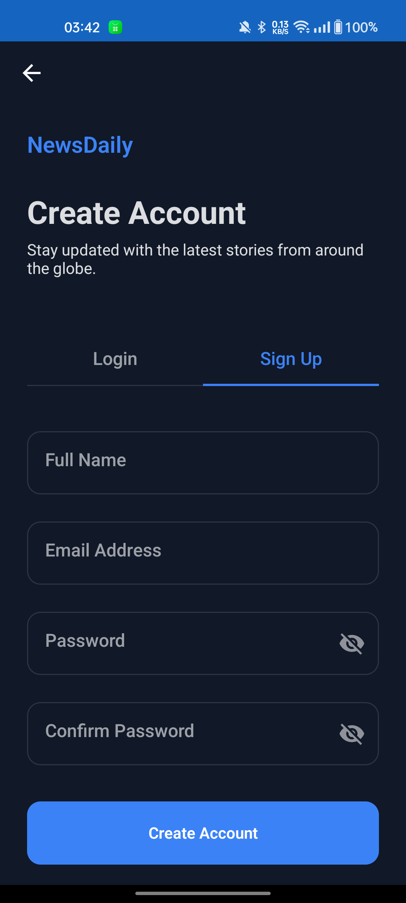 |

*   **Easy Signup**: Quickly create a new account in a few steps.
*   **Quick Checks**: Instantly shows if your email or password is incorrect.


### 🏠 4. Interactive News Dashboard
---
| Light Theme | Dark Theme |
| :---: | :---: |
| 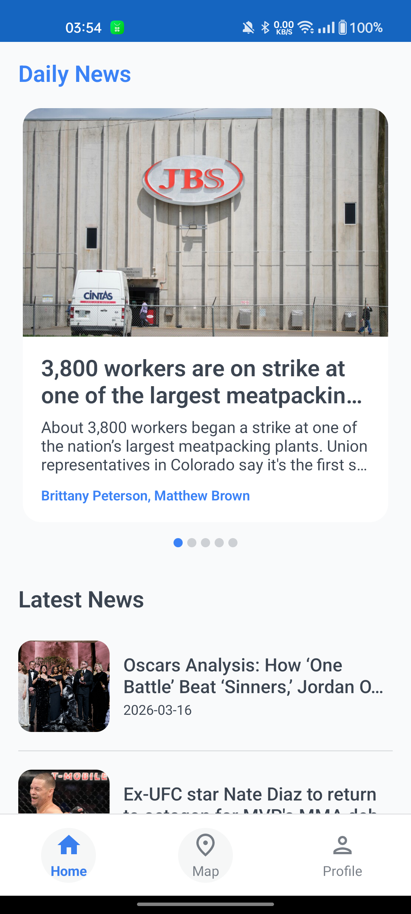 | 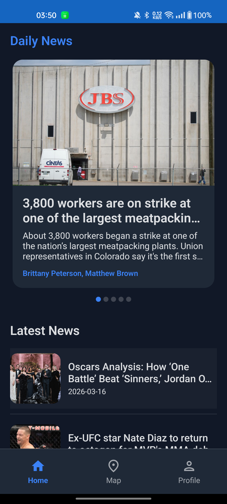 |

*   **Top Headlines**: A sliding banner that shows the main news.
*   **News Categories**: News is grouped into sections like Tech, Sports, and Health.
*   **Dark Mode**: Uses can choose Dark mode .

### 🗺️ 5. Intelligent News Map
---
| Light Theme | Dark Theme |
| :---: | :---: |
| 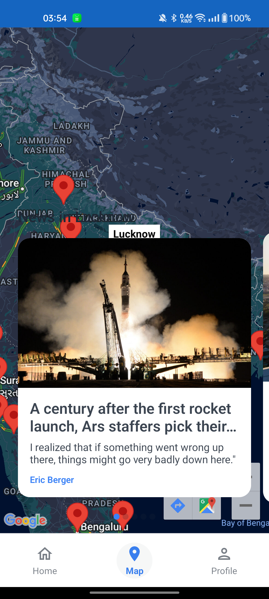 | 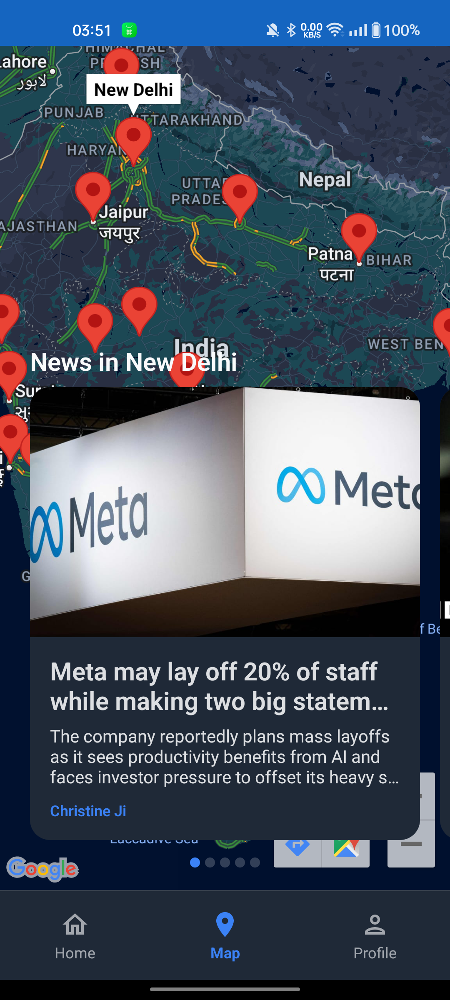 |

*   **City News**: Map markers show news from major cities in India.
*   **Click to View**: Tap a city marker to see the top 5 news from that place.
*   **Fast Reading**: Tap a news card to open the full story quickly.

### 👤 6. Advanced Profile Management
---
| Light Theme | Dark Theme |
| :---: | :---: |
| 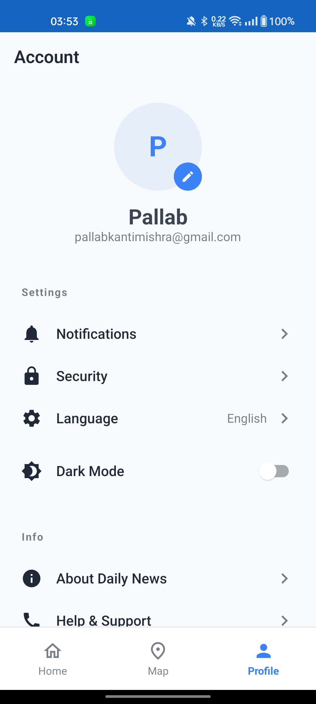 | 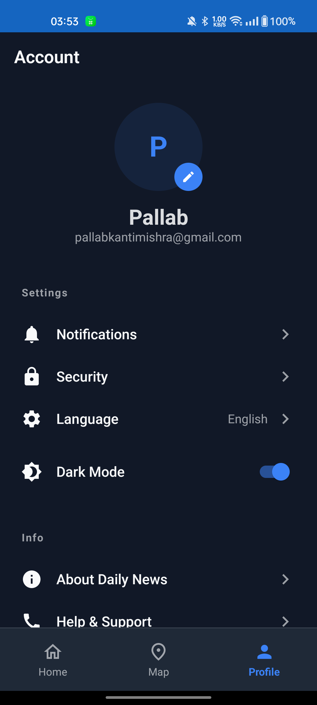 |

*   **Profile Tool**: Select a photo from your phone or take a new one.
*   **Safe Permissions**: Asks for permission before using the camera.
*   **Fast Photo Loading**: Loads your photo quickly using modern tools.
*   **Saves Offline**: Your photo is saved on your device even without internet.

### 🔔 7. Firebase Push Notification
---
| Light Theme |
| :---: |
| 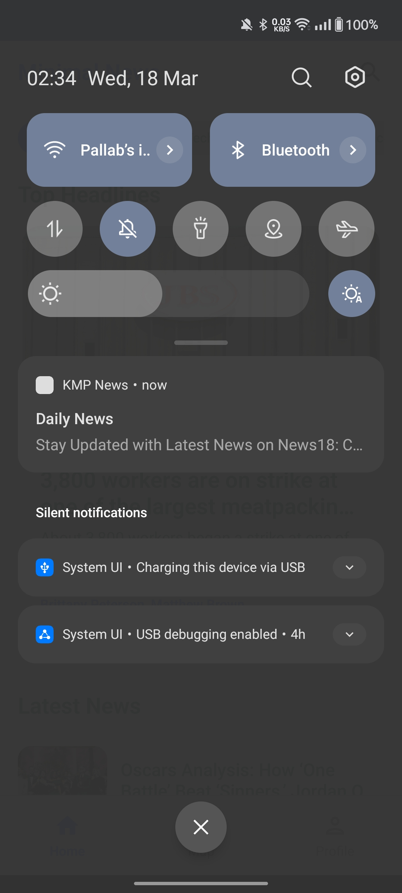 |
*   **Instant Alerts**: Get real-time notifications for important updates.
*   **Latest News Updates**: Stay updated with breaking news instantly.
*   **Smart Notifications**: Receive only relevant and useful alerts.
*   **Background Support**: Notifications work even when the app is closed.

### 🎥 8. Full Demo Video
---
| Light & Dark Theme |
| :---: |
|  |

*   **Complete Walkthrough**: Shows all app features step by step.
*   **Easy Understanding**: Helps users quickly learn how to use the app.
*   **Real App Preview**: See how the app works in real time.

---

## ✨ Core Features

- **🌐 Global News Access**: Real-time news updates from top-tier sources integrated via NewsAPI.
- **🗺️ Interactive Map News**: A unique Map feature where you can click on markers to see localized news in a smooth horizontal slider.
- **🌓 Dynamic Theming**: full implementation of Light and Dark modes with persistent user preference.
- **📸 Smart Profile**: Integrated camera and gallery support for personalized profile photos using `Peekaboo` and `moko-permissions`.
- **🔔 Real-time Notifications**: Firebase Push Notifications (FCM) to keep you updated on breaking news even when the app is closed.
- **📶 Offline-First Experience**: High-speed, offline-capable architecture powered by Room and background sync.

---

## 🛠️ Technical Stack & Library Use Cases

We leveraged the best-in-class KMP libraries to ensure stability and performance:

| Category | Library | Purpose |
| :--- | :--- | :--- |
| **Dependency Injection** | [Koin](https://insert-koin.io/) | Lightweight DI for sharing modules between common and platform code. |
| **Networking** | [Ktor](https://ktor.io/) | Multiplatform HTTP client for robust API interactions. |
| **Database** | [Room](https://developer.android.com/kotlin/multiplatform/room) | SQL-based persistence with multiplatform support for offline data. |
| **Navigation** | [Voyager](https://voyager.adriel.cafe/) | Powerful, type-safe navigation and ScreenModel (ViewModel) management. |
| **Image Loading** | [Coil 3](https://coil-kt.github.io/coil/) | Modern, fast image loading with Multiplatform support. |
| **Maps** | [KMPMaps](https://github.com/software-mansion-labs/kmp-maps) | Interactive Google Maps integration for KMP. |
| **Background Sync** | [WorkManager](https://developer.android.com/topic/libraries/architecture/workmanager) | Reliable periodic background sync for news updates. |
| **Testing** | [Mokkery](https://mokkery.dev/) | Compiler-plugin based mocking for clean, multiplatform unit tests. |
| **Camera/Gallery** | [Peekaboo](https://github.com/onseok/peekaboo) | Seamless image picking and camera support on both Android and iOS. |
| **Permissions** | [moko-permissions](https://github.com/icerockdev/moko-permissions) | Centralized permission handling logic. |

---


### Project Structure

```text
ROOT
├── composeApp          # Platform entry points (Android/iOS/web) & Shared UI Root
├── feature             # Feature-specific MVI logic & UI
│   ├── auth            # Login & Session management
│   ├── dashboard       # Profile & Main navigation tabs
│   ├── map             # Interactive Maps with News Slider
│   ├── news            # Core News Feed & Article Details
│   └── splash          # Startup & Auto-login logic
├── domain              # Business Logic (Pure Kotlin: UseCases, Models)
├── data                # Repositories & Data Sources implementation
└── core                # Shared Infrastructure
    ├── database        # Local Room Persistence
    ├── designsystem    # Common UI Components & Dark/Light Theme tokens
    ├── network         # Ktor HTTP Client & API Services
    ├── result          # Unified result handling (Success/Error)
    └── utils           # Helper extensions
```


## 👨‍💻 Getting Started

1.  **Clone the Repository**:
    ```bash
    git clone https://github.com/yourusername/KMPNewsApp.git
    ```
2.  **Configure Firebase**:
    - Add your `google-services.json` to the `composeApp/` directory.
3.  **Run with Gradle**:
    - Android: `./gradlew :composeApp:installDebug`
    - iOS: Open the `.xcodeproj` in Xcode or run via Android Studio's KMP Configuration.

---

## 🧪 Testing

The project uses **Mokkery** for project-wide mocking.
To run all tests:
```bash
./gradlew allTests
```

---


